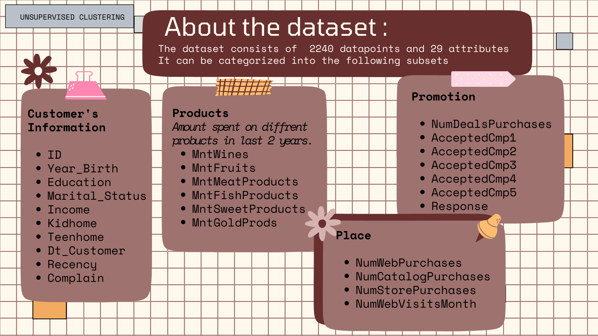

# CUSTOMER SEGMENTATION USING CLUSTERING

## INTRODUCTION

This project involves performing unsupervised clustering on customer records from a grocery firm's database. Customer segmentation is the practice of separating customers into groups that reflect similarities among customers in each cluster. The goal is to divide customers into segments to optimize the significance of each customer to the business, modify products according to distinct needs and behaviors of the customers, and cater to the concerns of different types of customers.

## INSTRUCTIONS

1. Use Copilot Chat to create a new notebook in your project. Use the command /newnotebook and name it "Customer Segmentation Clustering".
2. Use Copilot and Copilot Chat to develop the exercise and support your learning.

## EXERCISE

The objective of this project is to build a clustering model based on Scikit-learn and Python. The model should be able to segment customers into different clusters based on their purchasing behavior and other attributes.

### 1. Import Required Libraries

Import the following libraries for data analysis and visualization: numpy, pandas, datetime, matplotlib, seaborn, sklearn (including LabelEncoder, StandardScaler, PCA, KMeans, AgglomerativeClustering, and metrics), yellowbrick's KElbowVisualizer, and mpl_toolkits' Axes3D. Also, set a random seed for reproducibility and ignore any warnings.

### 2. Loading the Dataset

2.1. Load the dataset from a CSV file named "marketing_campaign.csv" with tab-separated values. Print the length of datapoints and display the first few rows of the dataset.
2.2. Display information about the features of a dataset stored in the dataframe.

### 3. Data Cleaning

3.1. Display the first 5 rows of the dataframe.  
3.2. Display the number of rows and columns in the dataframe.  
3.3. Display the data types of each column.  
3.4. Display the number of missing values in each column.  
3.5. Drop rows with missing values.  

### 4. Data Preprocessing & Feature Engineering

4.1. Create a feature indicating the number of days the customers have been registered in the firm's database and use the last date as max date in the data.
4.2. Check for unique values with their counts in the categorical features(Marital_Status, Education).
4.3. Extract the Age of a customer by Year_Birth and max date in the data and create a feature indicating the total amount spent by the customer in various categories.
4.4. Create features to indicate the living situation, number of children, family size, and parenthood status.
4.5. Segment the education levels into three groups(UnderGraducate, Graduate & PostGraduate).
4.6. Rename columns for clarity({"MntWines": "Wines","MntFruits":"Fruits","MntMeatProducts":"Meat","MntFishProducts":"Fish","MntSweetProducts":"Sweets","MntGoldProds":"Gold"}) and drop redundant features("Marital_Status", "Dt_Customer", "Z_CostContact", "Z_Revenue", "Year_Birth", "ID","Education").
4.7. Describe the data stats after the feature creations done earlier.
4.8. Plot selected features(Income, Recency, Days registered, age, total spent, is parent) together with different colors to visualize the data and identify outliers.
4.9.  Delete outliers by only keeping records where age<90 and income<600000 and print the total length of data points and assign it to the same dataframe.
4.10. Create a correlation matrix (excluding categorical attributes) and visualize it using a heatmap.
4.11. Get the list of categorical variables in the dataset and label encode the categorical features.

### 5. Dimensionality Reduction

5.1. Create a copy of data  & then Create a subset of the dataframe by dropping features related to deals accepted and promotions for dimensionality reduction.
5.2. Scale the subset dataframe features using standard scaler and print the scaled dataframe.
5.2. Perform PCA to the scaled dataframe to reduce the dimensions to 3.
5.2. Plot the 3D projection in reduced dimensions.

### 6. Clustering

6.1. Determine the optimal number of clusters using the elbow method on the PCA dataframe.
6.2. Fit the Agglomerative Clustering model with n_clusters-4 to get the final clusters.
6.3. Add the predicted clusters as a new feature to the original dataframe.
6.4. Examine the clusters formed with different colors using a 3-D scatter plot.

### 7. Evaluating Models via EDA to draw conclusions

7.1. Plot the countplot of clusters in the main dataframe.
7.2. Create a scatter plot to profile clusters based on “Income” on y and “Spent” on x.
7.3. Analyze the detailed distribution of clusters for various products (Wines, Fruits, Meat, Fish, Sweets, Gold) using swarm and boxen plots in one visualization.
7.4. Create a feature to sum accepted promotions and plot the count of total campaigns accepted by clusters.
7.5. Plot the number of deals purchased by clusters using a boxen plot.
7.6. Visualize the purchasing style in terms of “NumWebPurchases”, “NumCatalogPurchases”, “NumStorePurchases”, and “NumWebVisitsMonth” for all clusters using seaborn.

### 8. Profiling

8.1. Plot features indicative of the customer’s personal traits in light of the cluster they belong to.
8.2. Use the following features for profiling: “Kidhome”, “Teenhome”, “Customer_For”, “Age”, “Children”, “Family_Size”, “Is_Parent”.
8.3. Create joint plots for each feature against “Spent”, with clusters highlighted using different colors.  

### 9. Conclusion